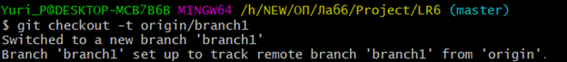
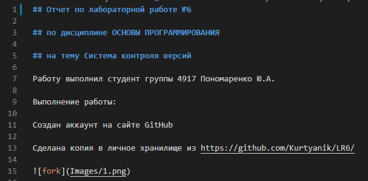

## Отчет по лабораторной работе №6

## по дисциплине ОСНОВЫ ПРОГРАММИРОВАНИЯ

## на тему Система контроля версий

Работу выполнил студент группы 4917 Пономаренко Ю.А.

Выполнение работы:

Создан аккаунт на сайте GitHub

Сделана копия в личное хранилище из https://github.com/Kurtyanik/LR6/

Установлен Git

Иницилизация git в нужной папке 

Настройка git с вводом имени пользователя и email 

Клонирование удаленного репозитория на компьютер

На сайте github создан файл file в ветке master

Загрузка файла file в локальный репозиторий

Получение истории операций для каждой из веток

Получение подробной информации о последнем изменении

Переключение на ветку branch1

Попытка слияния веток master и branch и получение конфликта

Разрешение конфликта после редактирования конфликтного файла mergefile

Слияние веток master и branch1

Удаление побочной ветки branch1 после успешного слияния

Добавление содержимого в удаленный репозиторий

Создание изменений несколько раз: созданы файлы testfile.txt и textfile2.txt

Откат последнего коммита 

Результат:

Создание ветки для отчета

Оформление отчета в файле README.md используя markdown синтаксис

Добавление папки с изображенияи в удаленный репозиторий

Получение истории операций в форматированном виде

